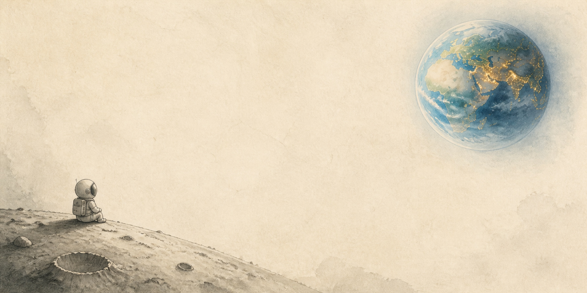
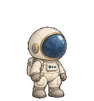

# 月地之间 · Moonlit Earth

> 从寂静的月面，遥望人间灯火。

一套相互呼应的 **Codex 纸质月球主题 + 原生小宇航员宠物**。暖白纸张、水彩石墨、低饱和地球蓝和城市金色灯火，让月面的安静与地球的热闹形成对照。



配套宠物 **望归 · Lunar**：纸白宇航服、蓝金面罩，平时安静呼吸，工作时操作胸前控制台，等你确认时轻轻伸手。



本项目是个人主题与素材合集，非 OpenAI 或 DreamSkin 官方产品。壁纸中的宇航员是静态画面；「望归」是另外安装的 Codex 原生动画宠物。

## 下载与使用

| 内容 | 下载 / 入口 | 怎么使用 |
| --- | --- | --- |
| 月地之间主题 v1.2 | [主题 ZIP](downloads/Moonlit-Earth-Direct-Import-v1.2.zip) | Dream Skin 菜单「导入主题 ZIP…」，再选择主题应用 |
| 望归宠物 v1 | [宠物 ZIP](downloads/Lunar-Codex-Pet-v1.zip) | 解压到 `~/.codex/pets/wanggui-lunar/`，在 Codex 宠物设置刷新并选择 |
| 全部宠物动作 | [离线预览页](pet/preview.html) | 下载整个仓库后，用浏览器打开此文件；GitHub 文件页本身不会播放 HTML |

两个 ZIP **不可互换**：宠物包不要导入 DreamSkin，主题包不要放到 Codex 的 `pets` 目录。项目没有启用 GitHub Pages，也没有 DreamSkin 社区一键换肤链接。

详细说明：[主题使用与兼容性](theme/README.md) · [宠物安装和动作](pet/README.md) · [校验和](downloads/SHA256SUMS.txt)

## 主题与宠物的关系

- **首页突出壁纸，工作页减少干扰。** 保留 `ambient` 工作模式；具体遮罩效果由 Dream Skin 引擎渲染，不同客户端可能有差异。
- **纸感保持一致。** 宠物采用象牙白服装、温灰线条和蓝金面罩，角色之外透明，不带矩形底图。
- **动画克制。** 宠物提供 9 种状态、57 个有效动画帧，包含呼吸、左右移动、挥手、轻跃、遇到难题、等待回应、工作和检查。
- **高级适配单独保留。** 置顶摘要、底部与右侧面板、首页输入框圆角等兼容代码放在 `theme/engine-compat/`；普通主题 ZIP 不会修改引擎。

## 项目结构

```text
theme/
  local-import/       壁纸 + 当前本地主题配置 + 最小 CSS
  studio-reference/   网站配置参考 + 独立可选 Safe CSS（实验性）
  engine-compat/      1.5.16 引擎兼容源码快照及原许可证
  source/             壁纸原始生成图
pet/
  package/            可安装的原生宠物文件
  previews/           9 个动作 GIF
  source-strips/      角色及动作生成源图
  preview.html        本地离线交互预览
docs/                 设计、提示词、校验记录和更新记录
downloads/            可下载的主题与宠物 ZIP
scripts/              无网络的预览逻辑检查
vendor/               使用到的第三方验证工具与许可证
```

## 兼容性与已知边界

- 主题制作基线：Dream Skin **1.5.16**；引擎面板/圆角适配基线：macOS Codex **26.831.21537**。不要用这里的旧版引擎快照直接覆盖新版引擎。
- 宠物采用 **Sprite v1**，已核对 Codex **26.915.31945** 的本地加载格式；不含 v2 的十六方向视线。完整帧序列、透明度和预览逻辑已检查，但没有宣称已完成 Codex 实机播放验收。
- 网站 Safe CSS 是单独的样式参考，不是正式投稿包，也不保证与本地引擎效果完全相同。网站输入区的外层方形底板问题仍属于待适配事项。
- 引擎升级可能覆盖自定义兼容修改。只导入主题、安装宠物不会覆盖应用程序文件。

## 制作资料与验证

[宠物设计](docs/pet-design.md) · [制作提示词](docs/pet-prompts.md) · [验证记录](docs/pet-validation.md) · [更新记录](docs/CHANGELOG.md)

视觉素材使用 AI 图像生成；宠物通过内置 imagegen 生成独立动作，左移动由已确认适合镜像的右移动逐帧派生。素材已整理到仓库，不依赖制作者电脑的绝对路径。

可选离线检查（Node.js；Python 3 + Pillow）：

```sh
node scripts/test_preview.cjs
python3 vendor/hatch-pet/scripts/validate_atlas.py pet/package/wanggui-lunar/spritesheet.webp
```

## 来源与许可

感谢 [Codex Dream Skin](https://github.com/Fei-Away/Codex-Dream-Skin) 和 [OpenAI hatch-pet](https://github.com/openai/skills/tree/main/skills/.curated/hatch-pet)。第三方代码分别保留其 MIT / Apache-2.0 许可证。原创素材尚未另行选定开放许可，不将第三方许可证扩大到全部图片或主题素材；详见 [来源与许可说明](THIRD_PARTY_NOTICES.md)。
